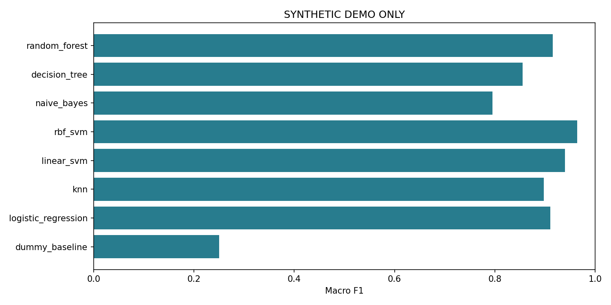

# Cyber Attack Classification: Research Companion

A runnable Python companion for **Dr. Naga Venkata Aswini Pavan Kumar Inguva's** research portfolio.

**Status:** post-publication implementation, created in 2026 with AI coding assistance. This is not the original code used for the 2024 article and does not reproduce its cited studies. The article surveys methods; this project supplies a new illustrative implementation. All bundled results use generated synthetic data. No real cybersecurity dataset has been benchmarked in this release.

## Related paper

NVA Pavan Kumar Inguva, Oludotun Oni, and Jacob Bryant (2024). *Exploring Machine Learning Algorithms for Cyber Attacks' Classification*. International Journal of Advanced Research in Science, Communication and Technology, 4(2), 417–420.

- DOI: https://doi.org/10.48175/IJARSCT-19438
- Full article: https://ijarsct.co.in/Paper19438.pdf
- Paper authorship does not imply that the co-authors wrote or endorse this software.

## What the project does

Compares logistic regression, K-nearest neighbors, linear SVM, RBF SVM, Gaussian naive Bayes, decision tree, and random forest, with a majority-class baseline. It reports accuracy, balanced accuracy, macro precision/recall/F1, ROC-AUC, model fitting time, prediction time, and per-class confusion matrices. Binary tasks additionally report attack recall and the false-positive rate, using an explicitly named attack label.



These scores only demonstrate that the software runs. Synthetic classes are not real network traffic or attack types. The repository must not be described as demonstrating real-world intrusion-detection performance.

## Start on a Mac

Use Python 3.12 (tested). Open Terminal inside the unzipped project folder:

```bash
python3 -m venv .venv
source .venv/bin/activate
python -m pip install -r requirements.txt
python experiment.py --demo --output results/my-first-demo
python -m unittest discover -s tests -v
```

On Windows, activate with `.venv\Scripts\activate` instead. Installation needs internet access; the demo itself does not.

Open `results/my-first-demo/metrics.csv` for the comparison and `comparison.png` for a chart. JSON files contain per-class reports and run provenance. Confusion matrices use actual labels on the vertical axis and predictions on the horizontal axis. Output folders must be empty to prevent accidental overwriting.

A notebook is included in `notebooks/quickstart.ipynb`. To use it, install Jupyter separately (`python -m pip install notebook`) and run `python -m notebook`. Terminal execution is sufficient; Jupyter is optional.

## Run a real dataset

See [dataset instructions](docs/DATASETS.md). The runner accepts headered CSV files with mixed numeric and categorical features. You must explicitly name the predictor columns and exclude identifiers, ground-truth proxies, and any future information. For a binary dataset with `label=1` denoting an attack:

```bash
python experiment.py --train data/train.csv --test data/test.csv \
  --label label --positive-label 1 \
  --features dur,proto,service,state,spkts,dpkts,sbytes,dbytes \
  --models dummy_baseline,logistic_regression,decision_tree,random_forest \
  --output results/real-data-run-1
```

If `--test` is omitted, the script makes a stratified 80/20 split after removing exact duplicate feature rows. Set `--test-size 0.3` for 70/30. Supply official train/test partitions when available. There is no automatic hyperparameter search and no ranking-based model selection. All models are evaluated on the same held-out split.

The feature subset above is an illustrative starting point for UNSW-NB15, not a validated feature selection result. Full-scale kernel SVM/KNN can be slow; the smaller model list is intentional for an initial real-data run.

## What is documented

- `docs/METHODS.md`: relationship to the paper and experimental limitations
- `docs/DATASETS.md`: dataset source, preparation, and citation requirements
- `docs/GITHUB_SETUP.md`: create an account and upload this project
- `CITATION.cff`: software credit and a separate reference to the article
- `examples/synthetic-demo/`: outputs from a real execution on synthetic data

## Reproducibility and limitations

Preprocessing is fitted only on the training partition. Exact duplicates are removed within each input; conflicting labels and train/test feature overlap cause an explicit error. This changes row counts and must be disclosed when comparing with other benchmarks. It does not detect near-duplicates, host/session correlations, or all forms of target leakage. Use time- or host-separated source files when required by your research question.

Seeds, software versions, feature names, model parameters, input-file hashes for CSV mode, and sample counts are recorded. Hardware affects timing. Prediction timing covers batch `predict`, not probability calculation, network capture, or deployed latency. Dense categorical encoding is capped at 30 categories per feature; very large datasets can still need substantial memory.

The shipped examples are synthetic. Validate on appropriate real datasets, add repeated or group-aware evaluation and confidence intervals, and investigate imbalance before making research claims. Do not repeatedly tune against the test results.

## License

No open-source license has been selected for this first draft. Public visibility does not itself grant reuse rights. The project owner should select a software license before promoting reuse. Dataset and paper rights remain separate; neither the article PDF nor external datasets are redistributed here.
